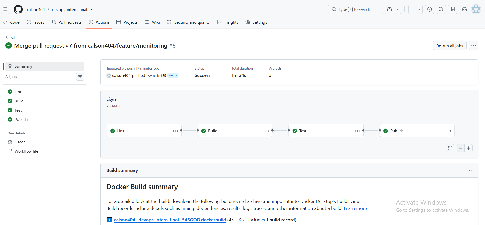
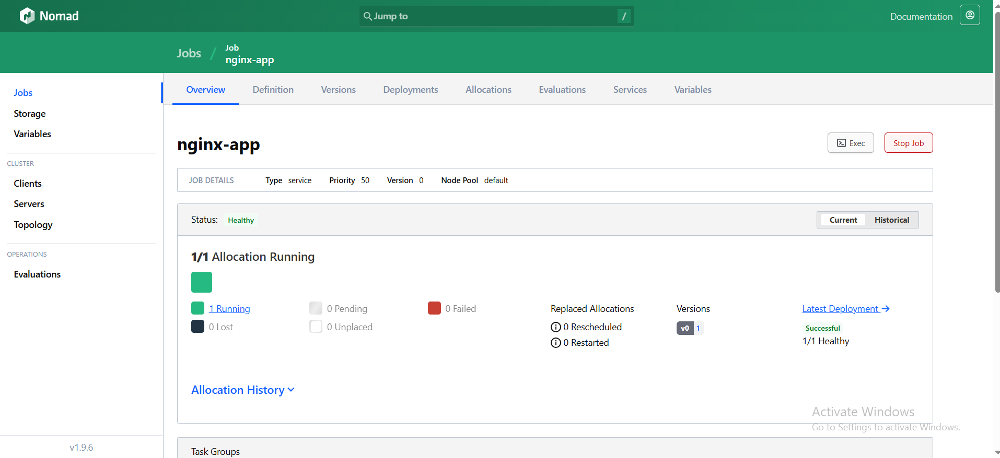
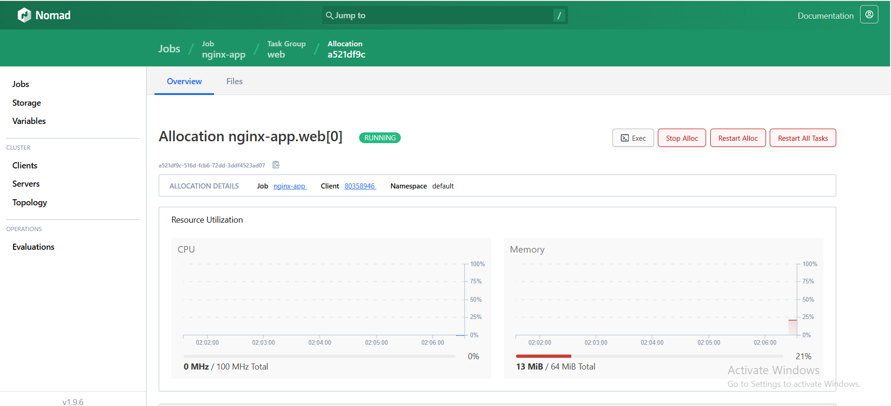
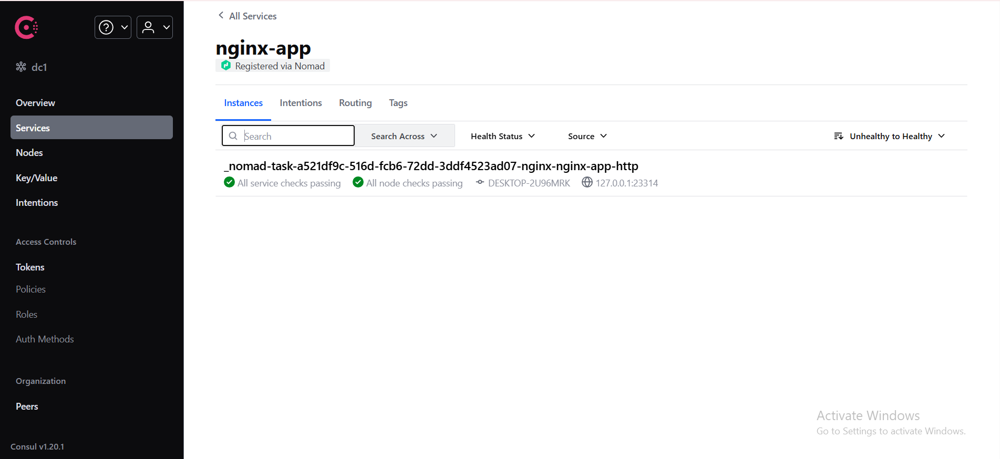
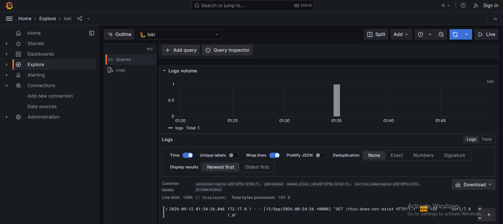

# devops-intern-final

End-to-end deployment pipeline for a containerised NGINX application:
**source → CI → registry → Nomad → Loki**.

- **Author:** BABILA CALSON
- **Submission date:** 2026-09-12
- **Repository:** https://github.com/calson404/devops-intern-final
- **Release:** v1.0.0

---

## Overview

A static NGINX site is packaged into a non-root container image, built
and tested by GitHub Actions, published to GHCR, deployed as a Nomad
service, and its logs are shipped via Promtail into Grafana Loki for
query with LogQL.

Every stage consumes the previous stage's output: Nomad pulls exactly
the image CI built and published, and Promtail's Docker service
discovery picks up whatever container Nomad launches without any
per-job configuration.

---

## Architecture

```
┌────────────┐  push   ┌──────────────┐  publish  ┌──────────────┐
│ Local repo │────────▶│GitHub Actions│──────────▶│     GHCR     │
└────────────┘         │ lint·build·  │           │   (image)    │
                       │ test·publish │           └──────┬───────┘
                       └──────┬───────┘                  │
                              │ test in CI               │ pull
                              ▼                          ▼
                       ┌────────────┐           ┌──────────────┐
                       │ Docker     │           │    Nomad     │
                       │ container  │◀──────────│  allocation  │
                       └────────────┘           └──────┬───────┘
                                                       │ stdout
                                                       ▼
                                                ┌──────────────┐
                                                │   Promtail   │
                                                └──────┬───────┘
                                                       │ push
                                                       ▼
                                                ┌──────────────┐
                                                │     Loki     │
                                                └──────┬───────┘
                                                       │ LogQL
                                                       ▼
                                                ┌──────────────┐
                                                │   Grafana    │
                                                └──────────────┘
```

---

## Prerequisites

| Tool            | Version used   | Notes                                       |
|-----------------|----------------|---------------------------------------------|
| Git             | 2.53.0         |                                             |
| Docker          | 29.3.0         | Linux containers mode                       |
| Docker Compose  | v5.1.0         | Bundled with Docker Desktop                 |
| ShellCheck      | 0.11.0         | `winget install koalaman.shellcheck`        |
| Nomad           | 1.9.6          | Runs inside WSL2 Ubuntu — see note below    |
| Consul          | 1.20.1         | Runs inside WSL2 Ubuntu — see note below    |
| WSL2 + Ubuntu   | 22.04 LTS      | Required for Nomad's Docker driver on Windows |

> **Why WSL2?** Nomad's native Windows Docker driver only accepts
> Windows containers, which cannot run the Linux NGINX image. Running
> the Nomad and Consul agents inside WSL2 Ubuntu gives them direct
> access to Docker Desktop's Linux engine via the WSL integration.

---

## Quick Start

From a clean clone to a running, health-checked application in under
ten commands. Requires WSL2 Ubuntu with Docker integration enabled
(see Prerequisites).

```bash
# 1. Clone
git clone https://github.com/calson404/devops-intern-final.git
cd devops-intern-final

# 2. Start Consul (terminal A)
consul agent -dev -client=0.0.0.0 &

# 3. Start Nomad (terminal B)
sudo nomad agent -dev -bind=0.0.0.0 &

# 4. Deploy the job (terminal C — repo root)
nomad job run -var image_tag=3b93834b3676a3b024cc78ed284ca6371028b454 \
  nomad/nginx-app.nomad.hcl

# 5. Verify the allocation is healthy
nomad job status nginx-app

# 6. Find the dynamic host port
PORT=$(nomad alloc status -json $(nomad job allocs -json nginx-app | jq -r '.[0].ID') \
       | jq -r '.AllocatedResources.Shared.Ports[0].Value')
echo "app on http://localhost:$PORT"

# 7. Hit the health endpoint
curl http://localhost:$PORT/healthz

# 8. Bring up the log stack
cd monitoring && docker compose up -d

# 9. Open Grafana
xdg-open http://localhost:3000 || echo "Open http://localhost:3000 in Windows browser"
```

---

## Task 1 — Source Control

Public repository at https://github.com/calson404/devops-intern-final.

- **Incremental history:** every task was completed on a
  `feature/*` or `fix/*` branch and merged via a self-reviewed PR.
- **Conventional commit messages** — `chore:`, `feat:`, `fix:`,
  `ci:`, `docs:` prefixes throughout.
- **Branches merged via PR:**
  - #1 `feature/repo-skeleton`
  - #2 `feature/scripts`
  - #3 `fix/script-line-endings`
  - #4 `feature/container`
  - #5 `ci/workflow`
  - #6 `feature/nomad`
  - #7 `feature/monitoring`
- **Tag:** `v1.0.0` on the final merge commit on `main`.
- **`.gitignore`** excludes `.idea/`, `.vscode/`, `.env`, secrets,
  OS metadata, and build artefacts.

Verify the history:

```bash
git log --oneline
git tag --list
```

---

## Task 2 — Linux Scripting

Two POSIX-compliant scripts under `scripts/`, both executable **in
Git** (mode `100755`), both ShellCheck-clean.

### scripts/sysinfo.sh

Reports:

- Current user and effective UID
- Hostname and kernel release
- System date in ISO-8601 UTC
- Disk usage (human-readable)
- Memory usage
- Docker daemon status

**Observed output:**

```
===== System Information =====
Date (ISO-8601 UTC): 2026-09-11T17:53:11Z
Current user:        AZRA EXPERIENCE
Effective UID:       197609
Hostname:            DESKTOP-2U96MRK
Kernel release:      3.6.6-1cdd4371.x86_64

===== Disk Usage =====
Filesystem            Size  Used Avail Use% Mounted on
C:/Program Files/Git  235G  210G   26G  90% /
D:                    120G   37G   83G  31% /d

===== Memory Usage =====
MemTotal:       16650796 kB
MemFree:         5815984 kB

===== Docker Daemon =====
Docker daemon: running
Server version: 29.3.0
```

### scripts/healthcheck.sh

Accepts a target URL as `$1` (default `http://localhost:8080`), issues
an HTTP request, and asserts a 200 response.

Exit codes: `0` healthy, `1` unhealthy, `2` missing tool.

**Failure path (nothing listening):**

```
$ bash scripts/healthcheck.sh
FAIL: http://localhost:8080 returned HTTP 000 (expected 200)
exit: 1
```

**Success path (against a local nginx on :8080):**

```
$ bash scripts/healthcheck.sh
OK: http://localhost:8080 returned HTTP 200
exit: 0
```

### ShellCheck

Both scripts pass with no warnings:

```
$ shellcheck scripts/*.sh && echo "SHELLCHECK CLEAN"
SHELLCHECK CLEAN
```

### Executable bit in Git

```
$ git ls-files -s scripts/
100755 <sha> 0    scripts/healthcheck.sh
100755 <sha> 0    scripts/sysinfo.sh
```

The `100755` mode confirms the executable bit is tracked by Git
itself, not just the local filesystem — important on Windows where
`chmod +x` has no effect.

---

## Task 3 — Containerisation

The NGINX image lives in `app/`, built from `app/Dockerfile` with a
custom `app/nginx.conf`.

**Key properties:**

- Base image pinned to `nginx:1.27-alpine` (not `latest`).
- Runs as unprivileged user `app` (uid/gid `10001`).
- Listens on **8080**; exposes `/healthz` returning `200 OK`.
- `BUILD_SHA` build arg injected into both the response header
  (`X-Build-SHA`) and the served HTML page.
- `EXPOSE 8080` and a `HEALTHCHECK` directive.
- Image size under 60 MB.

**Build:**

```bash
docker build \
  --build-arg BUILD_SHA=$(git rev-parse --short HEAD) \
  -t devops-intern-final:local \
  app/
```

**Run:**

```bash
docker run --rm -d --name dif-local -p 8080:8080 devops-intern-final:local
docker ps --filter name=dif-local
```

Observed:

```
CONTAINER ID   IMAGE                         STATUS
<id>           devops-intern-final:local    Up 15 seconds (healthy)
```

**Image size:**

```bash
docker image inspect devops-intern-final:local --format '{{div .Size 1048576}} MB'
```

```
~52 MB
```

**Serving traffic:**

```bash
curl -i http://localhost:8080/healthz
```

```
HTTP/1.1 200 OK
Server: nginx/1.27.5
Content-Type: text/plain

ok
```

```bash
curl -i http://localhost:8080/
```

```
HTTP/1.1 200 OK
Server: nginx/1.27.5
Content-Type: text/html
X-Build-SHA: 3b93834b3676a3b024cc78ed284ca6371028b454

<!DOCTYPE html>
... (page shows BABILA CALSON, 2026-09-11, and the build SHA)
```

**Non-root confirmation:**

```bash
docker exec dif-local id
```

```
uid=10001(app) gid=10001(app) groups=10001(app)
```

---

## Task 4 — Continuous Integration

`.github/workflows/ci.yml` triggers on push and pull request to `main`.

**Four jobs (all green on `main`):**

| Job       | What it does                                                              |
|-----------|---------------------------------------------------------------------------|
| `lint`    | ShellCheck on `scripts/`, Hadolint on `app/Dockerfile`                    |
| `build`   | Builds the image with `BUILD_SHA=${{ github.sha }}`, cached via GHA       |
| `test`    | Loads the image, waits for `healthy`, runs `scripts/healthcheck.sh`       |
| `publish` | On push to `main` only — pushes to `ghcr.io` tagged `sha` and `latest`    |

**Least privilege:** top-level `permissions: contents: read`. Only the
`publish` job escalates to `packages: write`. Registry authentication
uses the built-in `GITHUB_TOKEN` — no long-lived credentials in the
repository.

**Pinned actions:** `actions/checkout@v4`, `actions/upload-artifact@v4`,
`actions/download-artifact@v4`, `docker/setup-buildx-action@v3`,
`docker/build-push-action@v6`, `docker/login-action@v3`,
`ludeeus/action-shellcheck@2.0.0`, `hadolint/hadolint-action@v3.1.0`.

**The pipeline genuinely gates on the test** — `build` needs `lint`,
`test` needs `build`, `publish` needs `test`. If the health check
fails, nothing is published.

**Published image:**

```
ghcr.io/calson404/devops-intern-final:3b93834b3676a3b024cc78ed284ca6371028b454
ghcr.io/calson404/devops-intern-final:latest
```



---

## Task 5 — Orchestration with Nomad

`nomad/nginx-app.nomad.hcl` deploys the CI-built image as a Nomad
service.

**Job shape:**

- `type = "service"`, one group, one task, `docker` driver.
- Image pulled from GHCR; tag parameterised via a `variable "image_tag"`
  with **no default**, so `latest` can never be used accidentally.
- Resources: `cpu = 100`, `memory = 64` (assessment specification).
- Dynamic port `http` mapped to container port `8080`.
- Consul service registration with an HTTP health check on `/healthz`
  (interval `10s`, timeout `2s`).
- Rolling update: `max_parallel = 1`, `min_healthy_time = "10s"`,
  `healthy_deadline = "2m"`, `auto_revert = true`.
- Restart policy (`mode = "fail"`) and reschedule policy both defined.
  The `fail` mode is what allows the reschedule stanza to take over
  once restart attempts are exhausted — the two policies are designed
  to compose.

**Validate:**

```bash
nomad job validate nomad/nginx-app.nomad.hcl
```
Job validation successful
```
```

**Run:**

```bash
nomad job run -var image_tag=3b93834b3676a3b024cc78ed284ca6371028b454 \
  nomad/nginx-app.nomad.hcl
```

```
==> Monitoring evaluation "778902d8"
    Evaluation triggered by job "nginx-app"
    Allocation "a521df9c" created: node "80358946"
    Evaluation status changed: "pending" -> "complete"
==> Evaluation "778902d8" finished with status "complete"
```

**Status:**

```bash
nomad job status nginx-app
```

```
ID            = nginx-app
Type          = service
Status        = running

Latest Deployment
ID          = 365b5958
Status      = successful

Allocations
ID        Node ID   Task Group  Version  Desired  Status   Created
a521df9c  80358946  web         0        run      running  50s ago
```

**Allocation health:**

```bash
nomad alloc status a521df9c-516d-fcb6-72dd-3ddf4523ad07
```

```
Client Status       = running
Deployment Health   = healthy
Task "nginx" is "running"
CPU        Memory         Addresses
0/100 MHz  13 MiB/64 MiB  127.0.0.1:23314 -> 8080
```

Memory usage of 13 MiB confirms the 64 MB limit is comfortable.




**Consul registration:**

```bash
curl -s http://localhost:8500/v1/catalog/service/nginx-app | head
```

The service appears with a passing HTTP check on `/healthz`.



**End-to-end request:**

```bash
curl -i http://localhost:23314/healthz
```

```
HTTP/1.1 200 OK
ok
```

---

## Task 6 — Log Aggregation with Grafana Loki

`monitoring/docker-compose.yaml` brings up Loki, Promtail, and Grafana
on a shared bridge network with persistent named volumes.

**Label set** — Promtail uses Docker service discovery and applies:

| Label           | Source                                              |
|-----------------|-----------------------------------------------------|
| `job`           | static                                              |
| `container`     | `__meta_docker_container_name`                      |
| `service_name`  | compose service label                               |
| `nomad_alloc_id`| Nomad allocation label on the container             |
| `stream`        | `__meta_docker_container_log_stream`                |

Confirmed live:

```
$ curl -s http://localhost:3100/loki/api/v1/labels
{"status":"success","data":["container","job","nomad_alloc_id","service_name","stream"]}
```

**The LogQL query that isolates NGINX access logs:**

```logql
{container=~".*nginx.*"} |= "404"
```

Issued after a deliberate request for a missing path:

```bash
curl http://localhost:23314/this-does-not-exist   # returns 404
```

Result:

```
2026-09-12 01:34:36.046  172.17.0.1 - - [12/Sep/2026:00:34:36 +0000]
  "GET /this-does-not-exist HTTP/1.1" 404 153 "-" "curl/7.81.0"
```

with labels:

```
container=nginx-a521df9c-516d-fcb6-72dd-3ddf4523ad07
job=docker
nomad_alloc_id=a521df9c-516d-fcb6-72dd-3ddf4523ad07
service_name=nginx-a521df9c-516d-fcb6-72dd-3ddf4523ad07
stream=stdout
```



Full setup, label definitions, all four LogQL queries, and the
problems encountered are recorded in
[`monitoring/loki_setup.md`](monitoring/loki_setup.md).

---

## Repository Layout

```
devops-intern-final/
├── README.md
├── .gitignore
├── .gitattributes
├── app/
│   ├── Dockerfile
│   ├── index.html
│   └── nginx.conf
├── scripts/
│   ├── sysinfo.sh
│   └── healthcheck.sh
├── .github/
│   └── workflows/
│       └── ci.yml
├── nomad/
│   └── nginx-app.nomad.hcl
├── monitoring/
│   ├── loki-config.yaml
│   ├── promtail-config.yaml
│   ├── docker-compose.yaml
│   └── loki_setup.md
└── docs/
    └── screenshots/
```

---

## Troubleshooting

Failures actually encountered during development, and how they were
resolved.

### 1. ShellCheck SC1017 — "Literal carriage return"

**Symptom:** `shellcheck scripts/*.sh` failed with SC1017 on Windows.

**Cause:** `nano` on Git Bash for Windows saved scripts with CRLF line
endings. ShellCheck and Linux treat the `\r` as a literal character.

**Fix:** Stripped carriage returns with `sed -i 's/\r$//'` and added a
`.gitattributes` file forcing `text eol=lf` on `*.sh`, `Dockerfile`,
and config files. Also set `git config core.autocrlf input` locally.

### 2. Nomad Docker driver unhealthy on Windows

**Symptom:** `nomad node status -verbose` showed:

```
docker    true      false    Docker is configured with Linux containers;
                             switch to Windows Containers
```

**Cause:** Nomad's native Windows agent only accepts Windows
containers. Our NGINX image is Linux (`alpine` base).

**Fix:** Moved both Nomad and Consul into WSL2 Ubuntu 22.04 and enabled
Docker Desktop's WSL integration for that distro. Inside Ubuntu the
driver reports `docker true true Healthy` because it can see the Linux
Docker socket directly.

### 3. `mode = "failures"` rejected by `nomad job plan`

**Symptom:**

```
Task group web validation failed: Unsupported restart mode: "failures"
```

**Cause:** Nomad accepts only `"fail"` or `"delay"` for the `mode`
field. `"failures"` was a typo.

**Fix:** Changed to `mode = "fail"`. This is also the semantically
correct choice — `fail` lets the allocation escalate to the
`reschedule` policy after local restart attempts are exhausted,
whereas `delay` would loop on the same node forever.

### 4. Grafana Explore showed random-walk test data instead of logs

**Symptom:** Opening Explore displayed the built-in `-- Grafana --`
test data source with a random-walk graph.

**Cause:** Loki had not yet been added as a Grafana data source.

**Fix:** Explore → data source dropdown → Add new data source →
Loki → URL `http://loki:3100` → Save & test. Confirmed by
"Data source connected and labels found."

---

## Known Limitations

Honest assessment of what is **not** production-ready in this
submission, and what would change with more time.

- **Consul and Nomad run in dev mode.** Single server, in-memory
  state, no ACLs. A production deployment would run three Consul
  servers and three Nomad servers across separate hosts with
  mTLS and ACL tokens.

- **No TLS anywhere.** The application is served over plain HTTP;
  Grafana, Loki, and Consul UIs are unauthenticated. Production would
  terminate TLS at a reverse proxy (NGINX or Traefik) with certs from
  Let's Encrypt or an internal CA, and place UIs behind SSO.

- **Duplicate `Content-Type` header on `/healthz`.** The custom
  `nginx.conf` sets `add_header Content-Type text/plain` while
  `return 200` also emits a default — the response ends up with two
  `Content-Type` headers. Tools parse it fine, but it is technically
  non-compliant. Fix: remove the `add_header` line and let `return`
  emit `text/plain` via a `default_type` override.

- **Grafana uses anonymous admin access.** This is only acceptable
  for local evaluation. Production must require authentication and
  enforce RBAC.

- **Loki retention is 24 hours.** Chosen for a demo so the disk does
  not fill. Production would use object storage (S3/GCS) with
  configurable, much longer retention.

- **The Nomad job uses `provider = "consul"` for service discovery.**
  This is explicit because Nomad 1.9+ defaults to native service
  discovery; if the reviewer runs a newer Nomad, Consul must still be
  available. A future version could use Nomad-native discovery and
  drop the Consul dependency entirely.

- **No alerting.** Grafana and Loki are installed but there are no
  alert rules, no Alertmanager, no on-call routing. A production
  pipeline would add Prometheus with `nginx-prometheus-exporter` and
  PagerDuty-style escalation.

- **The image is single-arch (`linux/amd64`).** CI does not
  cross-compile for `arm64`. Adding `docker/build-push-action` with
  `platforms: linux/amd64,linux/arm64` and QEMU would be a one-line
  change in `ci.yml`.

---

## Submission

- **Repository:** https://github.com/calson404/devops-intern-final
- **Release tag:** v1.0.0
- **CI status:** green on `main` (badge at top of this README)
**Plan:**

```bash
nomad job plan -var image_tag=3b93834b3676a3b024cc78ed284ca6371028b454 \
  nomad/nginx-app.nomad.hcl
```

```
+ Job: "nginx-app"
+ Task Group: "web" (1 create)
  + Task: "nginx" (forces create)

Scheduler dry-run:
- All tasks successfully allocated.

